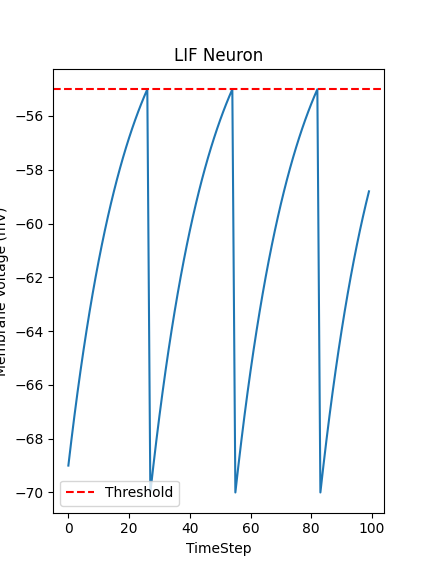

# Leaky Integrate-and-Fire-Model
A computational model of LIF model built from scratch in python using Euler's method.

## What is a LIF Neuron?
A computational model that describes how a neuron responds to incoming stimuli as it leaks, integrates and fire then reset.

## The Model
This model implements the value of Resting Potential, Membrane Voltage, Tau (RC), Resisitance, Input Current and Threshold, and computes the membrane voltage using the LIF first order linear ordinary differential equation (ODE) :
( tau*dV/dt = -(V_m-V_rest) + R*I_input ) using Euler method : (V_m + dV/dt* 1 tiny time step (dt)).

## Results 
The plot shows the firing of the neuron after reaching the threshold and how it resets to the resting potential afterwards.

## Biological Basis
- Hodgkin & Huxley (1952) — original neuron electrical model
- Lapicque (1907) — first integrate-and-fire model

## Dependencies
- Python 3
- Matplotlib

